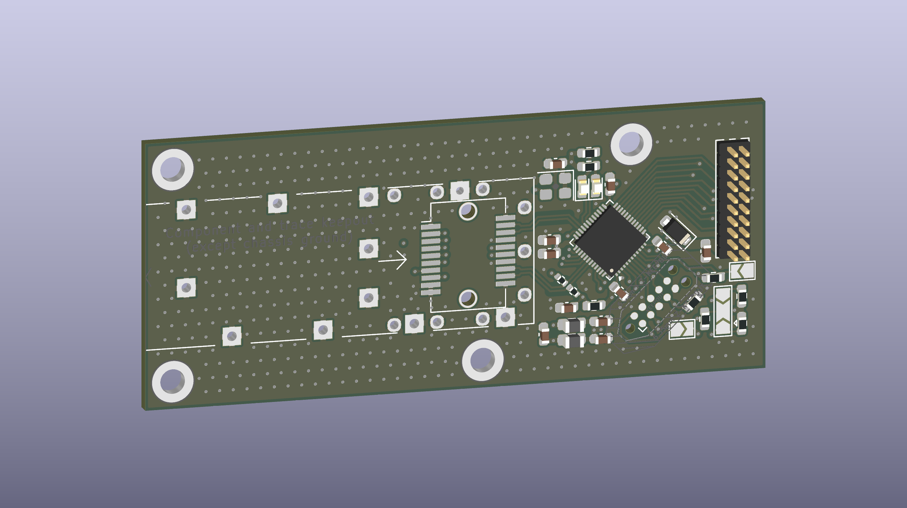
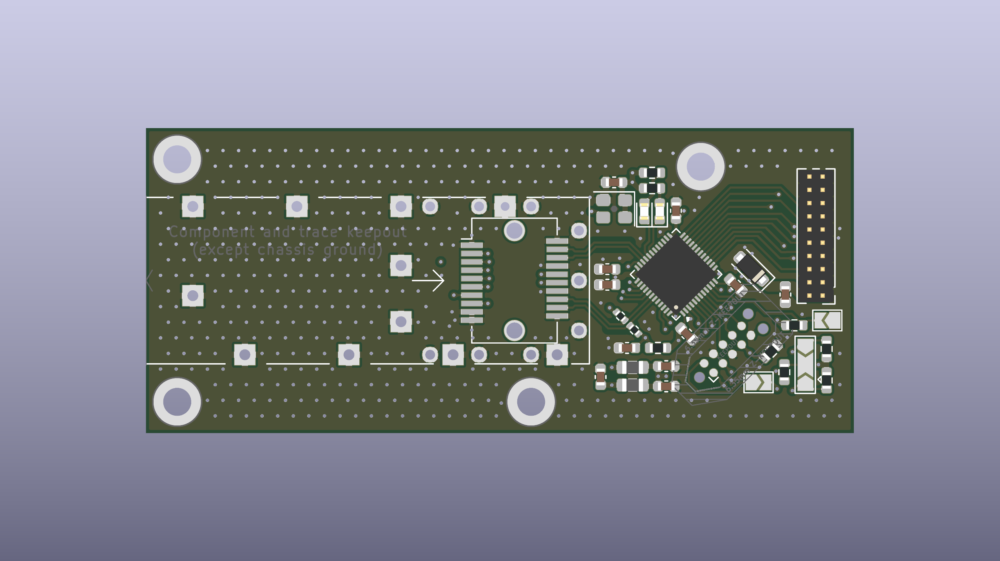
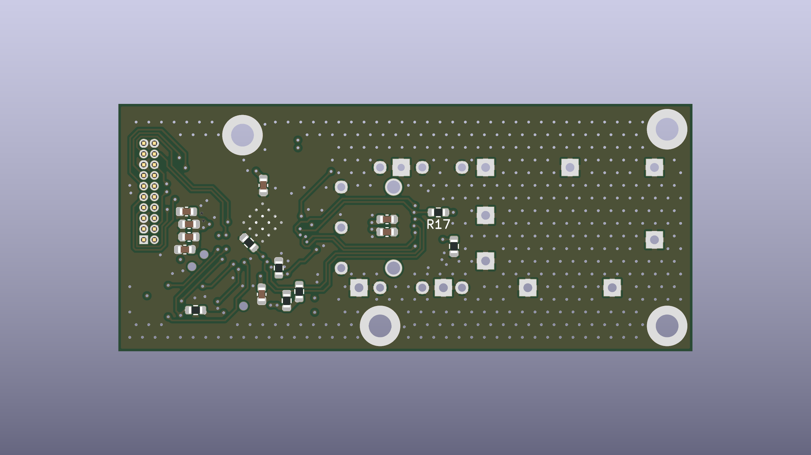

# SFP-xSPI Bridge
## Mostek OCTOSPI / QUADSPI / SPI ↔ SFP na FPGA Gowin GW1N-9

Moduł łączący dwa mikrokontrolery STM32 łączem światłowodowym punkt–punkt, bez stosu IP. Host zapisuje i odczytuje ramki przez OCTOSPI, QUADSPI lub zwykłe SPI; FPGA koduje je w 8b/10b i wysyła przez moduł SFP z prędkością 100 Mbaud, a po drugiej stronie odzyskuje zegar programowo (soft-CDR z nadpróbkowaniem). Tryb przezroczysty UART pozwala użyć pary mostków jako „przedłużacza” portu szeregowego, bez żadnego sterownika.


> **Status:** projekt FPGA ukończony i zweryfikowany w symulacji (testy modułów i testy end-to-end dwóch kompletnych mostków), biblioteka C dla STM32 gotowa i przetestowana na modelu mostka, schemat i PCB rev. A przed zamówieniem prototypu. Uruchomienie sprzętowe według [planu](doc/sfp-xspi-bridge-plan.md#9-plan-uruchomienia-bring-up).

```
STM32 ══ xSPI ══ GW1N-9 ══ LVDS ══ SFP ~~~ światłowód ~~~ SFP ══ LVDS ══ GW1N-9 ══ xSPI ══ STM32
```

---

## Płytka

<!-- Rendery generuje pcb/gen_media.kicad_jobset -->



| Góra (TOP) | Dół (BOTTOM) |
|---|---|
|  |  |

Płytka 4-warstwowa (JLC04161H-7628): pary LVDS na warstwie zewnętrznej nad ciągłą masą, płaszczyzna 3,3 V na warstwie wewnętrznej. Na płytce: klatka SFP, złącze hosta 2 × 10 (raster 1,27 mm), złącze programowania Tag-Connect TC2050 i zworka wyboru trybu. Zasilanie wyłącznie 3,3 V z hosta.

Wygenerowane PDF-y: [schemat](prod/sch/SFP_xSPI_Bridge.pdf) · [PCB](prod/pcb/SFP_xSPI_Bridge.pdf) · [interaktywny BOM](prod/ibom/SFP_xSPI_Bridge_ibom.html).

---

## Najważniejsze cechy

- **Łącze 100 Mbaud 8b/10b** przez standardowy moduł SFP bez wewnętrznego CDR (100BASE-FX / OC-3 lub 1000BASE-X, MM / SM, duplex lub BiDi).
- **Programowy odzysk zegara** — 4× nadpróbkowanie serializerami IDES8 (400 Msps), śledzenie fazy z histerezą, tolerancja odchyłki częstotliwości do ok. ±3900 ppm; oba końce na niezależnych generatorach, bez bufora elastycznego.
- **Ramki z CRC-32** (1–1024 B treści, pole TYPE do multipleksowania strumieni), kontrola przepływu XON/XOFF i gotowość odbiornika w sekwencji bezczynności — dane nie giną przy wolnym odbiorcy.
- **Interfejs hosta wzorowany na SPI NOR** — instrukcja i adres na 1 linii, dane na 1, 4 lub 8 liniach, SDR, tryb 0, SCLK do 40 MHz; współpracuje z OCTOSPI / XSPI / QUADSPI w trybie pośrednim i ze zwykłym SPI.
- **Spójne rejestry** — zatrzask przy opadnięciu CS, zapis stosowany po podniesieniu CS; FIFO TX 4 KiB i RX 8 KiB, przerwanie `HOST_IRQ_N`.
- **Tryb przezroczysty UART** — zworka lub rejestr; 8N1, 115 200 bit/s domyślnie, do ok. 3 Mbit/s, opcjonalnie RTS/CTS.
- **Zarządzanie modułem SFP** — I2C master w FPGA: pamięć A0h / A2h, automatyczny odczyt diagnostyki DDM, sygnały TX_DISABLE / TX_FAULT / LOS / MOD_ABS.
- **Diagnostyka łącza** — liczniki błędów kodu, CRC, długości, ramkowania, przepełnień i utrat synchronizacji; pętla zwrotna wewnątrz FPGA i echo ramek.
- **Biblioteka C dla STM32** konfigurowana przez `#define`, z portami HAL dla OCTOSPI, XSPI, QUADSPI i SPI.

---

## Specyfikacja

| Parametr | Wartość |
|---|---|
| FPGA | Gowin GW1N-UV9QN48C6/I5 (GW1N-9C), konfiguracja AUTOBOOT z wewnętrznej pamięci Flash |
| Łącze | 100 Mbaud, 8b/10b, ramki z CRC-32, bez retransmisji (błędy zgłaszane hostowi) |
| Przepustowość | do ok. 9,9 MB/s treści (ramki 1024 B) |
| Interfejs hosta | SPI 1-x-1, QSPI 1-0-4, OCTOSPI 1-0-8; SDR, tryb 0, SCLK ≤ 40 MHz |
| Bufory | FIFO TX 4 KiB, FIFO RX 8 KiB (BSRAM) |
| Tryb UART | 8N1, 115 200 bit/s (do ok. 3 Mbit/s), opcjonalnie RTS/CTS |
| Moduły SFP | INF-8074i, bez wewnętrznego CDR; SFP+ nieobsługiwane |
| Złącze hosta | 2 × 10, raster 1,27 mm: 3,3 V, SCLK, CS, IO0…IO7, DQS, IRQ, RST |
| Zasilanie | 3,3 V, ok. 0,45 A (moduł SFP do 300 mA) |
| PCB | 4 warstwy, 68 × 29,3 mm, 1,6 mm |
| Zajętość FPGA | 4483 LUT/ALU (52 %), 7 z 26 BSRAM; `clk_sys` 50 MHz (Fmax 56 MHz) |

---

## Architektura

```
             xSPI (SCLK ≤ 40 MHz)                                       LVDS 100 Mbaud
  STM32 ════════════════════════╗                                   ╔════════════════ SFP
                                ▼                                   │
          xspi_slave ─▶ csr_regs ─┬─▶ FIFO TX ─▶ framer + CRC ─▶ 8b/10b ─▶ OSER8 ─▶ TLVDS_OBUF ─▶ TD±
                                  │
                                  ├─◀ FIFO RX ◀─ deframer + CRC ◀─ 8b/10b ◀─ comma align ◀─ soft-CDR ◀─ IDES8 ◀─ RD±
                                  │
                                  ├─▶ I2C master + DDM ─▶ SFP SCL / SDA
                                  └─▶ sygnały SFP, LED, HOST_IRQ_N

  tryb UART:  UART_RX ─▶ pakietyzacja (ramki TYPE 0x01) ─▶ FIFO TX      FIFO RX ─▶ UART_TX
  zegary:     CLK_25M ─▶ rPLL 200 MHz (serializery) ─▶ CLKDIV /4 ─▶ clk_sys 50 MHz (logika)
```

Decyzje projektowe z uzasadnieniem: [rejestr ADR](doc/adr/README.md). Pełna koncepcja (piny, zegary, warstwa fizyczna, PCB, moduły, komendy, rejestry, uruchomienie): [`doc/sfp-xspi-bridge-plan.md`](doc/sfp-xspi-bridge-plan.md).

### Arkusze schematu

| Arkusz | Plik | Zawartość |
|---|---|---|
| root | [SFP_xSPI_Bridge.kicad_sch](pcb/SFP_xSPI_Bridge.kicad_sch) | połączenia hierarchiczne, otwory montażowe |
| EXT_IO | [ext_io.kicad_sch](pcb/ext_io.kicad_sch) | FPGA (zasilanie, konfiguracja, magistrala hosta), złącze hosta J3, Tag-Connect J2, zworki, TVS |
| SFP | [sfp.kicad_sch](pcb/sfp.kicad_sch) | klatka SFP, filtry zasilania modułu, terminacja i bias RX, generator 25 MHz, diody LED |

---

## Dokumentacja

| Dokument | Zawartość |
|---|---|
| [Interfejs hosta (datasheet)](doc/datasheet/index.md) | wyprowadzenia J3, parametry czasowe, komendy xSPI, mapa rejestrów, tryb UART, przykłady |
| [Biblioteka C (STM32)](doc/firmware.md) | konfiguracja, porty HAL, API, weryfikacja |
| [Koncepcja konstrukcji](doc/sfp-xspi-bridge-plan.md) | architektura, przydział pinów, zegary, PCB, moduły, uruchomienie |
| [Projekt FPGA](doc/vhdl/index.md) | moduły VHDL, testbenche, symulacja, wyniki syntezy |
| [Testy end-to-end](doc/e2e/index.md) | dwa mostki połączone łączem: SPI, QSPI, OSPI, UART — z przebiegami |
| [Decyzje (ADR)](doc/adr/README.md) | kontekst, warianty i konsekwencje decyzji projektowych |

Dokumentacja jako serwis MkDocs (`mkdocs` 1.6, `mkdocs-material` 9.x):

```
python -m mkdocs serve        # podgląd: http://127.0.0.1:8000
```

---

## Szybki start

**FPGA** — Gowin EDA (projekt `vhdl/sfp_bridge/sfp_bridge.gprj`, VHDL-2008):

```
cd vhdl/sfp_bridge
gw_sh build.tcl               # synteza, PnR i bitstream
```

Bitstream: `vhdl/sfp_bridge/impl/pnr/sfp_bridge.fs`, programowanie przez JTAG (Gowin Programmer lub openFPGALoader).

**Symulacja** — GHDL 5 (VHDL-2008), na Windows w WSL; modele prymitywów z instalacji Gowin EDA:

```
$env:GOWIN_SIMLIB = "<Gowin EDA>\IDE\simlib\gw1n"   # PowerShell
cd vhdl\sim
.\run_tests.ps1               # wszystkie testbenche; .\view.ps1 <tb> — przebieg w GTKWave
```

**Firmware** — biblioteka w `firmware/sfp_bridge/`: skopiować `config/sfpb_config_template.h` jako `sfpb_config.h`, ustawić transport i uchwyt peryferium, wywołać `sfpb_init(&dev, NULL)`. Testy na PC: `make -C firmware/tests`.

**Bez hosta** — dwa mostki ze zwartą zworką `MODE_SEL` i dwa konwertery USB-UART (115 200 8N1) tworzą przezroczysty kanał szeregowy przez światłowód.

---

## Weryfikacja

| Obszar | Zakres | Wynik |
|---|---|---|
| Moduły FPGA | 24 samosprawdzające testbenche GHDL, testy mutacyjne | PASS |
| Łącze | dwa końce z odchyłką 200 ppm i jitterem, CDR do ±1000 ppm i ±0,3 UI | PASS |
| End-to-end | dwa kompletne mostki (modele prymitywów Gowin): SPI, QSPI, OSPI, UART zworką i rejestrem | PASS |
| Synteza | pełny układ, ograniczenia czasowe spełnione (`clk_sys` 56 MHz, `clk_host` 44 MHz) | OK |
| Biblioteka C | 207 sprawdzeń na modelu mostka, 17 mutacji wykrytych; kompilacja portów dla L4R5, H563, F446, L476, G0B1 | PASS |
| Sprzęt | uruchomienie prototypu rev. A | do wykonania |

---

## Roadmap

- [x] **Koncepcja** — architektura, dobór FPGA i modułów SFP, protokół łącza, interfejs hosta
- [x] **Schemat i PCB rev. A** w KiCad 10
- [x] **FPGA** — wszystkie moduły, integracja, ograniczenia czasowe, testy end-to-end
- [x] **Biblioteka C dla STM32** z testami na modelu mostka
- [ ] **Pliki produkcyjne** rev. A, zamówienie i montaż prototypu
- [ ] **Uruchomienie** — konfiguracja FPGA, tryb UART przez światłowód, xSPI, I2C / DDM
- [ ] **Pomiary** — wykres oczkowy RD±, BER ≥ 10¹² bitów, różne moduły i tłumiki optyczne
- [ ] **Rozszerzenia** — 125 Mbaud, kolejna rewizja PCB z uwagami z uruchomienia

---

## Struktura repozytorium

```
.
├── doc/          # dokumentacja (MkDocs): koncepcja, datasheet, ADR, opisy modułów, testy end-to-end
├── firmware/     # biblioteka C dla STM32 (sfp_bridge), przykład, testy na PC
├── media/        # rendery 3D płytki
├── pcb/          # projekt KiCad 10 (schemat hierarchiczny, PCB, reguły DRC, biblioteka lokalna, jobsety)
├── prod/         # pliki produkcyjne: Gerbery (.zip), PDF schematu i PCB, interaktywny BOM
└── vhdl/         # projekt FPGA (Gowin EDA): źródła, ograniczenia, testbenche i skrypty symulacji
```

Pliki produkcyjne generują jobsety KiCad: [gen_prod.kicad_jobset](pcb/gen_prod.kicad_jobset) (PDF, BOM), [gen_gerber.kicad_jobset](pcb/gen_gerber.kicad_jobset) (Gerbery, wiercenia), [gen_media.kicad_jobset](pcb/gen_media.kicad_jobset) (rendery 3D).

---

## Referencje

- Gowin Semiconductor: DS100 (GW1N series), UG114 (GW1N-9 pinout), UG286 (zegary), UG289 (programowalne I/O), UG290 (programowanie i konfiguracja), UG284 (schematy), SUG935 (ograniczenia fizyczne)
- SFF Committee: INF-8074i (SFP MSA), SFF-8472 (diagnostyka modułów SFP)
- IEEE 802.3, klauzula 36 (kod 8b/10b, 1000BASE-X PCS)
- AMD/Xilinx XAPP224, XAPP523 — odzysk danych z nadpróbkowania
- STMicroelectronics: dokumentacja peryferiów OCTOSPI / XSPI / QUADSPI i sterowników HAL STM32Cube

---

## Licencja

[MIT](LICENSE) © 2026 bartkepl
