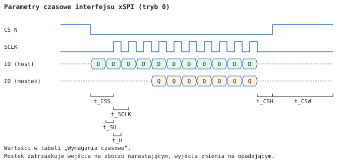
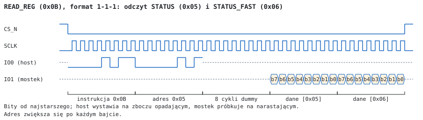
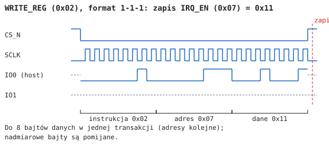
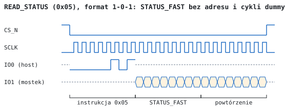
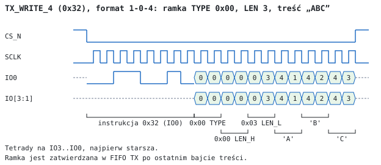
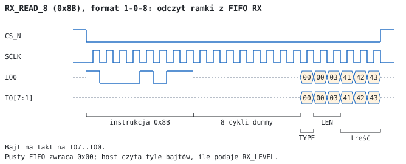
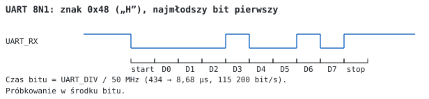

# SFP-xSPI Bridge — interfejs hosta

**Rozdział dokumentacji technicznej: komunikacja SPI / QSPI / OSPI, tryb przezroczysty UART, mapa rejestrów**

Wersja bitstreamu: `VERSION` = 0x01 · płytka rev. A · źródło: kod VHDL `vhdl/sfp_bridge/src` (commit z etapem 10)

---

## 1 Cechy

- Interfejs hosta SPI, Quad-SPI i Octal-SPI w trybie 0, SDR, do **40 MHz**
- Zestaw komend wzorowany na pamięciach SPI NOR: instrukcja 8-bitowa, adres 8-bitowy, cykle dummy
- Przesył ramek do 1024 bajtów treści przez łącze światłowodowe SFP 100 Mbaud (8b/10b, CRC-32)
- Bufory FIFO: nadawczy 4 KiB, odbiorczy 8 KiB; sterowanie przepływem łącza bez udziału hosta
- 256-bajtowa przestrzeń rejestrów z **zatrzaskiem przy opadnięciu CS** (spójny odczyt wartości wielobajtowych)
- Przerwanie `HOST_IRQ_N` z maskowaniem źródeł
- Tryb przezroczysty **UART 8N1** (zworka lub rejestr): 9600 bit/s … 6,25 Mbit/s, opcjonalnie RTS/CTS
- Dostęp do pamięci modułu SFP (EEPROM A0h, diagnostyka DDM A2h) przez skrzynkę poleceń I2C
- Automatyczny odczyt DDM (temperatura, napięcie, prąd lasera, moc optyczna) co 100 ms … 25,5 s
- 8 liczników zdarzeń łącza (32 bity)

## 2 Opis

SFP-xSPI Bridge łączy mikrokontroler (np. STM32 z OCTOSPI, QUADSPI lub SPI) z modułem światłowodowym SFP. Host zapisuje ramki do bufora nadawczego komendami `TX_WRITE`, mostek opatruje je ramkowaniem i sumą CRC-32 i wysyła łączem do drugiego mostka, który udostępnia je swojemu hostowi komendami `RX_READ`. Stan łącza, przerwania, liczniki i obsługa modułu SFP są dostępne przez rejestry (`READ_REG` / `WRITE_REG`).

W trybie przezroczystym UART mostek nie wymaga hosta xSPI: bajty odebrane na linii `UART_RX` jednego mostka pojawiają się na `UART_TX` drugiego.

```
            ┌──────────────────────────── SFP-xSPI Bridge ────────────────────────────┐
  SCLK ────►│                                                                         │
  CS_N ────►│ xspi_slave ──► FIFO TX 4 KiB ──► ramkowanie, CRC-32, 8b/10b ──► TD± ─── │──► moduł SFP
  IO[7:0]◄─►│     │      ◄── FIFO RX 8 KiB ◄── kontrola ramek, 8b/10b, CDR  ◄── RD± ─── │◄── moduł SFP
            │     ▼                                                                   │
HOST_IRQ_N◄─│ rejestry (csr_regs) ── stan łącza, liczniki (link_ctrl)                 │
HOST_RST_N─►│     │                                                                   │
            │     └── zarządzanie SFP (I2C, DDM, TX_DISABLE/LOS/TX_FAULT/MOD_ABS) ─── │◄─► SCL/SDA, sygnały SFP
  MODE_SEL─►│ uart_bridge (tryb UART: IO0 = RX, IO1 = TX, IO2 = RTS_N, IO3 = CTS_N)   │
            └─────────────────────────────────────────────────────────────────────────┘
```

## 3 Wyprowadzenia złącza hosta J3

Złącze 2 × 10, raster 1,27 mm. Kierunki z punktu widzenia mostka.

| Pin | Nazwa | Typ | Tryb xSPI | Tryb UART |
|---|---|---|---|---|
| 1, 2 | 3V3 | zasilanie | wejście 3,3 V | wejście 3,3 V |
| 3, 5, 15, 19, 20 | GND | masa | — | — |
| 4 | XSPI_SCLK | wejście | zegar | nieużywany |
| 6 | XSPI_CS_N | wejście (pull-up) | wybór układu, aktywny niskim | nieużywany |
| 7 | XSPI_IO0 | we/wy | IO0 (dane od hosta w formatach 1-x-1) | **UART_RX** (wejście) |
| 8 | XSPI_IO1 | we/wy | IO1 (dane do hosta w formatach 1-x-1) | **UART_TX** (wyjście) |
| 9 | XSPI_IO2 | we/wy | IO2 | **UART_RTS_N** (wyjście, przy `RTSCTS_EN`; inaczej stan wysokiej impedancji) |
| 10 | XSPI_IO3 | we/wy | IO3 | **UART_CTS_N** (wejście, przy `RTSCTS_EN`) |
| 11–14 | XSPI_IO4…IO7 | we/wy | IO4…IO7 (tylko OSPI) | stan wysokiej impedancji |
| 16 | XSPI_DQS | wyjście | nieużywany, stan wysokiej impedancji | stan wysokiej impedancji |
| 17 | HOST_IRQ_N | wyjście push-pull | przerwanie, aktywne niskim | stan łącza: 1 = łącze aktywne |
| 18 | HOST_RST_N | wejście (pull-up) | reset mostka, aktywny niskim | reset mostka |

Wybór trybu: zworka lutowana JP3 (`MODE_SEL`, pin 10 FPGA) — **otwarta: xSPI**, zwarta do masy: UART. Stan zworki jest odczytywany w czasie każdego resetu mostka.

## 4 Parametry

### 4.1 Warunki pracy i charakterystyki DC

| Parametr | Min | Typ | Max | Jednostka | Uwagi |
|---|---|---|---|---|---|
| Napięcie zasilania 3V3 | 3,135 | 3,3 | 3,465 | V | dolna granica wynika z modułu SFP (INF-8074i) |
| Napięcie zasilania, wartość graniczna | | | 3,75 | V | GW1N-UV (DS100, tab. 3-1) |
| Pobór prądu (z modułem SFP), szacunek | | 0,45 | 0,6 | A | moduł SFP do 0,3 A, FPGA 50–100 mA (koncepcja konstrukcji, 5.4) |
| V_IL wejść J3 | −0,3 | | 0,8 | V | LVCMOS33 (DS100, tab. 3-12) |
| V_IH wejść J3 | 2,0 | | 3,6 | V | |
| V_OL wyjść (I_OL = 8 mA) | | | 0,4 | V | |
| V_OH wyjść (I_OH = −8 mA) | V_3V3 − 0,4 | | | V | |

### 4.2 Wymagania czasowe interfejsu xSPI



| Symbol | Parametr | Min | Max | Jednostka |
|---|---|---|---|---|
| f_SCLK | częstotliwość SCLK | | 40 | MHz |
| t_SCLK | okres SCLK | 25 | | ns |
| t_CSS | CS_N niski → pierwsze zbocze narastające SCLK | 25 | | ns |
| t_CSH | ostatnie zbocze opadające SCLK → CS_N wysoki | 12,5 | | ns |
| t_CSW | CS_N wysoki między transakcjami | 100 | | ns |
| t_SU | dane hosta przed zboczem narastającym SCLK | 8,5 | | ns |
| t_H | dane hosta po zboczu narastającym SCLK | do następnego zbocza opadającego | | |
| t_V | zbocze opadające SCLK → dane mostka ważne | | t_SCLK − 3 | ns |

Wartości projektowe: wynikają z ograniczeń czasowych syntezy (`vhdl/constraints/sfp_bridge.sdc`, analiza czasowa spełniona przy 40 MHz) i z symulacji (t_CSS, t_CSH, t_CSW); wymagają potwierdzenia pomiarem na płytce rev. A.

**Uwaga — odczyt przy 40 MHz.** Mostek zmienia dane na zboczu opadającym SCLK. Host powinien próbkować je z opóźnieniem pół okresu, tj. na kolejnym zboczu opadającym (STM32 OCTOSPI/QUADSPI: `SampleShifting = HALFCYCLE`, pole SSHT). Przy próbkowaniu na zboczu narastającym budżet czasu to t_SCLK / 2 minus opóźnienia ścieżek i może nie wystarczyć przy 40 MHz.

### 4.3 Wydajność

| Ścieżka | Przepustowość |
|---|---|
| Łącze SFP (100 Mbaud, 8b/10b) | 10 MB/s znaków; dla ramek 1024 B ok. 9,9 MB/s treści (narzut 11 znaków na ramkę) |
| SPI 40 MHz (`TX_WRITE_1` / `RX_READ_1`) | do 5 MB/s |
| QSPI 40 MHz (`_4`) | do 20 MB/s |
| OSPI 40 MHz (`_8`) | do 40 MB/s |
| UART | do 6,25 Mbit/s (UART_DIV = 8), zalecane ≤ 3 Mbit/s |

Przy QSPI i OSPI przepustowość ogranicza łącze; bufor TX (4 KiB) pozwala zapisać ramki szybciej, niż są wysyłane.

## 5 Opis szczegółowy

### 5.1 Tryby pracy

| Tryb | Warunek | Dostęp xSPI | Zegar strony hosta |
|---|---|---|---|
| xSPI | zworka otwarta, `MODE_CTRL.UART_MODE` = 0, `MODE_CTRL.FRAME_ECHO` = 0 | tak | SCLK |
| UART | zworka zwarta **lub** `MODE_CTRL.UART_MODE` = 1 | nie | 50 MHz wewnętrzny |
| Echo ramek | `MODE_CTRL.FRAME_ECHO` = 1 (poza trybem UART) | nie | 50 MHz wewnętrzny |

- Zapis do `MODE_CTRL` zmieniający `UART_MODE` lub `FRAME_ECHO` resetuje mostek (zawartość FIFO jest tracona). `MODE_CTRL` i `UART_DIV` przetrwają ten reset.
- Z trybu UART lub echa ustawionego rejestrem wraca się do trybu xSPI wyłącznie przez `HOST_RST_N` albo ponowne włączenie zasilania.
- Echo ramek: każda ramka odebrana z łącza jest odsyłana bez zmian — test łącza z drugiej strony.

### 5.2 Reset i uruchomienie

| Źródło | Działanie | Zachowane rejestry |
|---|---|---|
| Włączenie zasilania | ładowanie konfiguracji FPGA z wewnętrznej pamięci Flash, zablokowanie PLL, reset | — |
| `HOST_RST_N` = 0 przez ≥ 640 ns | reset całego mostka (krótsze impulsy są filtrowane) | `UART_STATUS` |
| `CTRL.SOFT_RST` = 1 | reset mostka, samoczynnie kończony po kilku taktach | `MODE_CTRL`, `UART_DIV`, `UART_STATUS` |
| zmiana `UART_MODE` / `FRAME_ECHO` | jak `SOFT_RST` | `MODE_CTRL`, `UART_DIV`, `UART_STATUS` |

Po resecie host odpytuje `READ_ID`, aż otrzyma `0x5B 0x5F` — wtedy mostek jest gotowy (niewysterowane linie danych dają same jedynki). Stan łącza sprawdza się bitem `STATUS_FAST.LINK_UP`.

### 5.3 Łącze i stan łącza

| Stan | Znaczenie | `LINK_UP` |
|---|---|---|
| DOWN | brak modułu (`MOD_ABS`), brak sygnału (`LOS`, o ile nie `LOS_IGNORE`) lub brak synchronizacji znaków | 0 |
| SYNC | własny odbiornik zsynchronizowany, strona przeciwna jeszcze nie | 0 |
| UP | oba odbiorniki zsynchronizowane | 1 |

Ramki są wysyłane tylko w stanie UP; ramki zapisane wcześniej czekają w FIFO TX. Ramka: `K27.7` (SOF), `TYPE`, `LEN_H`, `LEN_L`, treść, CRC-32 (4 B), `K29.7` (EOF). Odbiornik zapisuje do FIFO RX wyłącznie ramki kompletne i poprawne; błędne odrzuca i zlicza. Gdy w FIFO RX zostaje mniej niż 3145 B wolnego miejsca, mostek wstrzymuje nadawanie strony przeciwnej (XOFF) i wznawia je powyżej 4169 B — host odbiorczy nie musi nadążać z odczytem, dane nie są tracone.

### 5.4 Format ramki w buforach

| Bajt | Pole | Opis |
|---|---|---|
| 0 | `TYPE` | typ ramki: 0x00 dane; **0x01 strumień UART** (zarezerwowany dla trybu UART); pozostałe wartości do dowolnego użytku |
| 1 | `LEN_H` | starszy bajt długości treści |
| 2 | `LEN_L` | młodszy bajt długości treści |
| 3 … LEN + 2 | treść | 1 … 1024 bajty |

`LEN` = 0 lub `LEN` > 1024: ramka jest wysyłana (bufor pozostaje spójny), ale odbiornik ją odrzuca i zwiększa licznik `LEN_ERR`. Poprawność `LEN` należy do hosta.

## 6 Programowanie

### 6.1 Zasady transakcji

- Tryb 0 (CPOL = 0, CPHA = 0), najstarszy bit pierwszy, SDR. Host wystawia dane na zboczu opadającym SCLK, mostek próbkuje na narastającym; mostek wystawia dane na zboczu opadającym.
- Instrukcja i adres zawsze na jednej linii (IO0). Dane: formaty 1-x-1 — od hosta na IO0, do hosta na IO1; formaty 1-0-4 / 1-0-8 — IO3…IO0 / IO7…IO0, w trybie 4-liniowym najpierw starsza tetrada.
- Transakcja kończy się podniesieniem CS_N. Nieznana instrukcja jest ignorowana do końca transakcji.
- Rejestry 0x00–0x53 są zatrzaskiwane przy opadnięciu CS_N (gotowe ok. 80 ns później) i nie zmieniają się do końca transakcji. Zapis `WRITE_REG` jest stosowany po podniesieniu CS_N, wszystkie bajty transakcji jednocześnie. Między transakcjami CS_N musi pozostać wysoki ≥ 100 ns.

### 6.2 Komendy

| Opkod | Nazwa | Format | Adres | Dummy | Dane | Opis |
|---|---|---|---|---|---|---|
| 0x9F | READ_ID | 1-0-1 | — | 0 | 4 B | `0x5B`, `0x5F`, `VERSION`, `0x00` (dalej 0x00) |
| 0x05 | READ_STATUS | 1-0-1 | — | 0 | 1 B, powtarzany | `STATUS_FAST` |
| 0x0B | READ_REG | 1-1-1 | 8 bit | 8 | n B | rejestry od adresu, adres +1 po bajcie (0xFF → 0x00) |
| 0x02 | WRITE_REG | 1-1-1 | 8 bit | 0 | 1–8 B | rejestry od adresu; bajty powyżej 8 są pomijane |
| 0x12 | TX_WRITE_1 | 1-0-1 | — | 0 | n B | bajty ramek do FIFO TX |
| 0x32 | TX_WRITE_4 | 1-0-4 | — | 0 | n B | jw., 4 linie |
| 0x82 | TX_WRITE_8 | 1-0-8 | — | 0 | n B | jw., 8 linii |
| 0x13 | RX_READ_1 | 1-0-1 | — | 8 | n B | bajty ramek z FIFO RX |
| 0x6B | RX_READ_4 | 1-0-4 | — | 8 | n B | jw., 4 linie |
| 0x8B | RX_READ_8 | 1-0-8 | — | 8 | n B | jw., 8 linii |
| 0x66 | TX_ABORT | 1-0-0 | — | — | — | porzucenie niezatwierdzonej (częściowo zapisanej) ramki |







### 6.3 Wysyłanie ramek

1. Sprawdzić miejsce: `STATUS_FAST.TX_READY` = 1 (≥ 1027 B, czyli największa ramka) albo `TX_SPACE` ≥ `LEN` + 3.
2. Zapisać `TYPE`, `LEN_H`, `LEN_L` i treść komendą `TX_WRITE_x`. Ramkę można podzielić na kilka transakcji i zapisać kilka ramek w jednej transakcji.
3. Ramka jest zatwierdzana w FIFO TX po ostatnim bajcie treści i od tej chwili czeka na wysłanie. `TX_ABORT` porzuca ramkę jeszcze niezatwierdzoną.
4. Zapis przy pełnym FIFO TX gubi bajt i ustawia `IRQ_STAT.ERR`.



### 6.4 Odbieranie ramek

1. Czekać na `HOST_IRQ_N` (źródło `RX_FRAME`) lub odpytywać `STATUS_FAST.RX_AVAIL`.
2. Odczytać `RX_LEVEL` (0x0C–0x0D) — liczba bajtów kompletnych ramek w FIFO RX.
3. Odczytać `RX_LEVEL` bajtów komendą `RX_READ_x` i rozdzielić na ramki według `LEN`. Odczyt można podzielić na kilka transakcji; bajty pobrane z wyprzedzeniem, a niewysłane, pozostają dla następnej komendy `RX_READ`.
4. Odczyt przy pustym FIFO zwraca 0x00.



### 6.5 Przerwania

`HOST_IRQ_N` = 0, gdy (`IRQ_STAT` AND `IRQ_EN`) ≠ 0. Bity `IRQ_STAT` ustawiają zdarzenia, a kasuje zapis 1 (W1C); zdarzenie w takcie kasowania wygrywa. Typowa obsługa: `READ_REG` 0x08 → obsługa źródeł → `WRITE_REG` 0x08 z odczytaną wartością.

### 6.6 Moduł SFP (I2C i DDM)

Odczyt pamięci modułu, np. nazwy producenta (A0h, bajty 20–35):

```
WRITE_REG 0x30: 0x50, 0x14, 0x10, 0x01   ; I2C_DEV = 0x50, OFFSET = 20, LEN = 16, CMD = READ
READ_REG  0x34 … aż BUSY = 0             ; lub przerwanie I2C_DONE
READ_REG  0x80, 16 bajtów                ; I2C_BUF
```

Zapis: dane do `I2C_BUF` (do 8 bajtów na transakcję `WRITE_REG`), potem `I2C_CMD` = 0x02. Pamięć EEPROM modułu po zapisie nie potwierdza adresu przez czas zapisu wewnętrznego — polecenie kończy się wtedy `NACK` i należy je ponowić. Zapis w czasie `BUSY` jest odrzucany (`BAD_CMD`); `I2C_BUF` nie jest zatrzaskiwany i w czasie `BUSY` ma nieokreśloną zawartość.

Diagnostyka DDM jest odczytywana automatycznie (0x40–0x4C). Dla modułów z kalibracją wewnętrzną (A0h, bajt 92, bit 5) wartości przelicza się wg SFF-8472:

| Rejestr | Typ | Jednostka |
|---|---|---|
| `DDM_TEMP` | int16 | 1/256 °C |
| `DDM_VCC` | uint16 | 100 µV |
| `DDM_TXBIAS` | uint16 | 2 µA |
| `DDM_TXPWR`, `DDM_RXPWR` | uint16 | 0,1 µW |

### 6.7 Tryb przezroczysty UART



**Konfiguracja**

| Parametr | Wartość |
|---|---|
| Format | 8N1, najmłodszy bit pierwszy, poziom spoczynkowy wysoki |
| Prędkość | f = 50 MHz / `UART_DIV`; `UART_DIV` ≥ 8; po resecie sprzętowym 434 (115 200 bit/s) |
| Tolerancja odbiornika | ok. ±4 % (jedna próbka w środku bitu) |
| Pakietowanie | ramka `TYPE` 0x01 po 64 bajtach albo po przerwie 20 czasów bitu od bitu stopu ostatniego bajtu |
| RTS_N (IO2) | 1 (wstrzymaj nadawcę), gdy w FIFO TX zostaje < 512 B; sterowany tylko przy `RTSCTS_EN` |
| CTS_N (IO3) | mostek zaczyna nadawać bajt tylko przy CTS_N = 0 (przy `RTSCTS_EN`) |

| Prędkość [bit/s] | `UART_DIV` | Rzeczywista [bit/s] | Błąd |
|---|---|---|---|
| 9 600 | 5208 | 9 600,6 | +0,01 % |
| 19 200 | 2604 | 19 201,2 | +0,01 % |
| 38 400 | 1302 | 38 402,5 | +0,01 % |
| 57 600 | 868 | 57 603,7 | +0,01 % |
| **115 200** | **434** | 115 207,4 | +0,01 % |
| 230 400 | 217 | 230 414,7 | +0,01 % |
| 460 800 | 109 | 458 715,6 | −0,45 % |
| 921 600 | 54 | 925 925,9 | +0,47 % |
| 1 000 000 | 50 | 1 000 000 | 0 |
| 2 000 000 | 25 | 2 000 000 | 0 |
| 3 000 000 | 17 | 2 941 176,5 | −1,96 % |

**Wybór prędkości innej niż 115 200 bit/s** wymaga hosta xSPI (zworka otwarta):

```
WRITE_REG 0x51: 0x32, 0x00     ; UART_DIV = 50  (1 Mbit/s), oba bajty w jednej transakcji
WRITE_REG 0x50: 0x01           ; MODE_CTRL.UART_MODE = 1 (0x05: z RTS/CTS) → reset, tryb UART
```

`UART_DIV` przetrwa reset wywołany zmianą trybu. W trybie wybranym zworką obowiązuje wartość po resecie sprzętowym (115 200 bit/s).

Po powrocie do trybu xSPI (`HOST_RST_N`) host odczytuje w `UART_STATUS` zdarzenia z sesji UART (utracone bajty, błędy bitu stopu); rejestr kasuje się zapisem jedynek (W1C).

**Zachowanie.** Bajty z `UART_RX` mostka A pojawiają się na `UART_TX` mostka B w tej samej kolejności, z opóźnieniem pakietowania (do 64 znaków lub 20 czasów bitu) i przesyłu ramki. Mostek odbiorczy wysyła bajt dopiero po odebraniu całej poprawnej ramki. Ramki innych typów niż 0x01 są w trybie UART pomijane. Przy różnych prędkościach po obu stronach i bez RTS/CTS bajty, które nie mieszczą się w buforach strony nadawczej, są tracone. Host xSPI po jednej stronie może wymieniać dane z urządzeniem UART po drugiej, wysyłając i odbierając ramki `TYPE` 0x01.

## 7 Mapa rejestrów

Adresy bajtowe; wartości wielobajtowe little-endian (młodszy bajt pod niższym adresem). Typy dostępu: **R** odczyt, **W** zapis (odczyt zwraca 0), **R/W**, **W1C** — kasowanie zapisem 1. Adresy nieopisane: odczyt 0, zapis ignorowany.

### 7.1 Zestawienie

| Adres | Nazwa | Typ | Reset | Opis |
|---|---|---|---|---|
| 0x00–0x01 | ID | R | 0x5F5B | identyfikator mostka |
| 0x02 | VERSION | R | 0x01 | wersja bitstreamu |
| 0x04 | CTRL | R/W | 0x03 | sterowanie łączem i resetem |
| 0x05 | STATUS | R | — | stan łącza i modułu SFP |
| 0x06 | STATUS_FAST | R | — | stan dla odpytywania (`READ_STATUS`) |
| 0x07 | IRQ_EN | R/W | 0x00 | maska przerwań |
| 0x08 | IRQ_STAT | W1C | 0x00 | zdarzenia przerwań |
| 0x0A–0x0B | TX_SPACE | R | 0x1000 | wolne miejsce w FIFO TX [B] |
| 0x0C–0x0D | RX_LEVEL | R | 0x0000 | bajty kompletnych ramek w FIFO RX |
| 0x10–0x2F | CNT_* | R | 0 | liczniki zdarzeń, 8 × 32 bity |
| 0x30 | I2C_DEV | R/W | 0x50 | adres urządzenia I2C |
| 0x31 | I2C_OFFSET | R/W | 0x00 | offset w urządzeniu |
| 0x32 | I2C_LEN | R/W | 0x00 | liczba bajtów polecenia |
| 0x33 | I2C_CMD | W | — | polecenie I2C |
| 0x34 | I2C_STATUS | R | 0x00 | stan polecenia I2C |
| 0x40–0x49 | DDM_* | R | 0 | wartości DDM |
| 0x4A | DDM_FLAGS | R | 0x00 | bajt stanu DDM modułu |
| 0x4B | DDM_STAT | R | 0x00 | stan odczytu DDM |
| 0x4C | DDM_SEQ | R | 0x00 | licznik odczytów DDM |
| 0x4F | DDM_PERIOD | R/W | 0x0A | okres odczytu DDM |
| 0x50 | MODE_CTRL | R/W | 0x00 | tryb pracy (zachowywany przy resecie programowym) |
| 0x51–0x52 | UART_DIV | R/W | 0x01B2 | dzielnik prędkości UART (zachowywany przy resecie programowym) |
| 0x53 | UART_STATUS | W1C | 0x00 | zdarzenia UART (kasowany tylko przy włączeniu zasilania i zapisem W1C) |
| 0x80–0xFF | I2C_BUF | R/W | — | bufor danych I2C, 128 B (bez zatrzasku) |

### 7.2 CTRL (0x04)

| Bit | Pole | Typ | Reset | Opis |
|---|---|---|---|---|
| 7 | SOFT_RST | W | 0 | 1: reset mostka (`MODE_CTRL`, `UART_DIV` zachowane) |
| 6 | CNT_CLR | W | 0 | 1: wyzerowanie liczników `CNT_*` |
| 5 | — | R/W | 0 | zarezerwowany, bez funkcji |
| 4 | LOS_IGNORE | R/W | 0 | 1: sygnał LOS modułu nie wyłącza łącza |
| 3 | SFP_TX_DIS | R/W | 0 | stan linii TX_DISABLE modułu (1: laser wyłączony); w czasie resetu linia = 1 |
| 2 | LB_NEAR | R/W | 0 | 1: pętla zwrotna wewnątrz mostka (nadajnik → odbiornik, bez modułu) |
| 1 | RX_EN | R/W | 1 | 1: odbiornik włączony; 0: strona przeciwna widzi odbiornik niegotowy |
| 0 | TX_EN | R/W | 1 | 1: wysyłanie ramek dozwolone |

### 7.3 STATUS (0x05)

| Bit | Pole | Opis |
|---|---|---|
| 7 | MOD_ABS | 1: brak modułu SFP (filtr 10 ms) |
| 6 | TX_FAULT | 1: moduł zgłasza błąd nadajnika (filtr 50 µs) |
| 5 | LOS | 1: moduł nie odbiera sygnału optycznego (filtr 50 µs) |
| 4 | XOFF_REMOTE | 1: strona przeciwna wstrzymała nasze nadawanie |
| 3 | XOFF_LOCAL | 1: wstrzymujemy nadawanie strony przeciwnej (FIFO RX zapełnione) |
| 2 | REMOTE_READY | 1: odbiornik strony przeciwnej zsynchronizowany |
| 1 | SYNC | 1: własny odbiornik zsynchronizowany |
| 0 | LINK_UP | 1: łącze w stanie UP |

### 7.4 STATUS_FAST (0x06)

| Bit | Pole | Opis |
|---|---|---|
| 7:6 | — | 0 |
| 5 | MODE_SEL | stan zworki trybu (1: otwarta, xSPI), odczytany przy resecie |
| 4 | IRQ | 1: `HOST_IRQ_N` aktywne |
| 3 | TX_EMPTY | 1: FIFO TX puste |
| 2 | TX_READY | 1: `TX_SPACE` ≥ 1027 (zmieści się największa ramka) |
| 1 | RX_AVAIL | 1: w FIFO RX jest co najmniej jedna kompletna ramka |
| 0 | LINK_UP | 1: łącze w stanie UP |

### 7.5 IRQ_EN (0x07), IRQ_STAT (0x08)

Ten sam układ bitów; `IRQ_EN` R/W — maska, `IRQ_STAT` W1C — zdarzenia.

| Bit | Pole | Zdarzenie |
|---|---|---|
| 7:6 | — | zarezerwowane |
| 5 | ERR | błąd odbioru ramki (CRC, kod 8b/10b, długość, ramkowanie, przepełnienie FIFO RX) lub bajt utracony przy zapisie do pełnego FIFO TX |
| 4 | I2C_DONE | koniec polecenia I2C hosta (także odrzuconego) |
| 3 | SFP_CHG | zmiana LOS, TX_FAULT lub MOD_ABS |
| 2 | LINK_CHG | zmiana stanu łącza |
| 1 | TX_EMPTY | FIFO TX opróżnione |
| 0 | RX_FRAME | ramka odebrana i zapisana do FIFO RX |

### 7.6 Liczniki CNT_* (0x10–0x2F)

32 bity, little-endian, zawijanie po 2³², zerowanie bitem `CTRL.CNT_CLR`. Odczyt czterech bajtów w jednej transakcji `READ_REG` jest spójny.

| Adres | Licznik | Zlicza |
|---|---|---|
| 0x10 | CODE_ERR | błędne znaki 8b/10b (kod lub dysparytet) przy zsynchronizowanym odbiorniku |
| 0x14 | CRC_ERR | ramki odrzucone z powodu CRC |
| 0x18 | LEN_ERR | ramki odrzucone z powodu długości (`LEN` = 0, > 1024 lub EOF w złym miejscu) |
| 0x1C | FRAMING_ERR | nieoczekiwany znak sterujący w ramce |
| 0x20 | RX_OVF | ramki odrzucone z braku miejsca w FIFO RX |
| 0x24 | FRAMES_TX | ramki wysłane |
| 0x28 | FRAMES_RX | ramki odebrane poprawnie |
| 0x2C | SYNC_LOSS | utraty synchronizacji znaków |

### 7.7 Rejestry I2C (0x30–0x34)

| Adres | Pole | Opis |
|---|---|---|
| 0x30 | I2C_DEV[6:0] | adres 7-bitowy (0x50 = A0h, 0x51 = A2h) |
| 0x31 | I2C_OFFSET | pierwszy bajt w urządzeniu |
| 0x32 | I2C_LEN | 1–128 |
| 0x33 | I2C_CMD | 0x01 READ, 0x02 WRITE; inne wartości ignorowane |
| 0x34 | I2C_STATUS | b0 BUSY, b1 NACK (brak potwierdzenia), b2 TIMEOUT (SCL trzymany > 25 ms lub zablokowana magistrala), b3 BAD_CMD (LEN poza 1–128, brak modułu, polecenie w czasie BUSY; do następnego przyjętego polecenia) |

`BUSY` = 1 już w transakcji następującej bezpośrednio po zapisie `I2C_CMD`. Magistrala: 100 kHz, wydłużanie SCL przez moduł obsługiwane.

### 7.8 Rejestry DDM (0x40–0x4F)

| Adres | Pole | Źródło (A2h) |
|---|---|---|
| 0x40–0x41 | DDM_TEMP | bajty 96–97 |
| 0x42–0x43 | DDM_VCC | 98–99 |
| 0x44–0x45 | DDM_TXBIAS | 100–101 |
| 0x46–0x47 | DDM_TXPWR | 102–103 |
| 0x48–0x49 | DDM_RXPWR | 104–105 |
| 0x4A | DDM_FLAGS | 110 |
| 0x4B | DDM_STAT | b0 VALID (dane z udanego odczytu od włożenia modułu), b1 NACK, b2 TIMEOUT (ostatni odczyt) |
| 0x4C | DDM_SEQ | +1 po każdym udanym odczycie |
| 0x4F | DDM_PERIOD | okres × 100 ms; 0 = odczyt wyłączony |

Wartości są przepisywane w module z kolejności big-endian na little-endian i aktualizowane razem po udanym odczycie. Pierwszy odczyt: 300–400 ms po włożeniu modułu. Moduły bez DDM odpowiadają NACK (`DDM_STAT.NACK` = 1).

### 7.9 MODE_CTRL (0x50)

| Bit | Pole | Typ | Reset | Opis |
|---|---|---|---|---|
| 7:3 | — | — | 0 | zarezerwowane |
| 2 | RTSCTS_EN | R/W | 0 | 1: RTS/CTS w trybie UART |
| 1 | FRAME_ECHO | R/W | 0 | 1: tryb echa ramek (zmiana resetuje mostek) |
| 0 | UART_MODE | R/W | 0 | 1: tryb UART (zmiana resetuje mostek) |

Kasowany tylko przez reset sprzętowy (`HOST_RST_N`, zasilanie).

### 7.10 UART_DIV (0x51–0x52), UART_STATUS (0x53)

`UART_DIV` — liczba taktów 50 MHz na bit UART, ≥ 8; reset 434. Oba bajty należy zapisać w jednej transakcji `WRITE_REG`. Kasowany tylko przez reset sprzętowy.

`UART_STATUS`: b0 RX_OVF (bajt UART utracony — bufor lub FIFO TX pełne), b1 FRAME_ERR (błędny bit stopu; bajt jest odrzucany); W1C. Bity są ustawiane w trybie UART, w którym rejestry nie są dostępne. Rejestr kasuje wyłącznie włączenie zasilania i zapis W1C — `HOST_RST_N` i reset programowy go nie zmieniają, więc po powrocie do trybu xSPI zawiera zdarzenia z sesji UART.

### 7.11 I2C_BUF (0x80–0xFF)

128 bajtów: wynik polecenia READ (od 0x80) albo dane polecenia WRITE. Odczytywany bezpośrednio, bez zatrzasku przy CS — zawartość stała, gdy `I2C_STATUS.BUSY` = 0.

## 8 Zastosowanie

### 8.1 Podłączenie do STM32

| J3 | STM32 OCTOSPI | QUADSPI | SPI |
|---|---|---|---|
| XSPI_SCLK | OCTOSPI_CLK | QUADSPI_CLK | SCK |
| XSPI_CS_N | OCTOSPI_NCS | QUADSPI_BK1_NCS | NSS (GPIO) |
| XSPI_IO0…IO3 | IO0…IO3 | IO0…IO3 | IO0 = MOSI, IO1 = MISO |
| XSPI_IO4…IO7 | IO4…IO7 | — | — |
| HOST_IRQ_N | EXTI | EXTI | EXTI |
| HOST_RST_N | GPIO (otwarty dren lub push-pull) | jw. | jw. |

Konfiguracja OCTOSPI w trybie pośrednim (indirect): instrukcja 8-bitowa na 1 linii, adres 8-bitowy na 1 linii (tylko `READ_REG` / `WRITE_REG`), dane na 1/4/8 liniach, cykle dummy według tabeli komend, `SampleShifting` = połowa cyklu, zegar ≤ 40 MHz, minimalny czas CS wysokiego ≥ 100 ns (np. `ChipSelectHighTime` ≥ 4 cykle przy 40 MHz).

### 8.2 Przykład: inicjalizacja i wymiana ramek

Poniższa sekwencja pokazuje kolejność komend; gotową implementację dla STM32 zawiera [biblioteka C](../firmware.md).

```c
/* 1. gotowość */
do { read_id(id, 2); } while (id[0] != 0x5B || id[1] != 0x5F);
write_reg(0x07, 0x05);                 /* IRQ_EN: RX_FRAME | LINK_CHG */
while (!(read_status() & 0x01)) {}     /* LINK_UP */

/* 2. wysłanie ramki: TYPE 0x00, LEN = n */
while (!(read_status() & 0x04)) {}     /* TX_READY */
uint8_t hdr[3] = { 0x00, n >> 8, n & 0xFF };
tx_write8(hdr, 3); tx_write8(data, n); /* lub w jednej transakcji */

/* 3. odbiór (po przerwaniu RX_FRAME) */
uint8_t st = read_reg8(0x08); write_reg(0x08, st);   /* IRQ_STAT, W1C */
uint16_t lvl = read_reg16(0x0C);                     /* RX_LEVEL */
rx_read8(buf, lvl);                                  /* ramki: TYPE, LEN_H, LEN_L, treść */
```

### 8.3 Uruchomienie bez hosta

Dwa mostki ze zwartą zworką JP3 i dwa konwertery USB-UART (115 200 8N1) tworzą przezroczysty kanał szeregowy przez światłowód — test łącza przed napisaniem sterownika. Dioda `LED_LINK` świeci przy zestawionym łączu, miga przy łączu jednostronnym; `LED_ACT` błyska przy ramkach.
