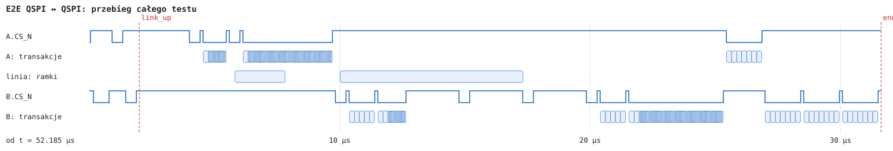
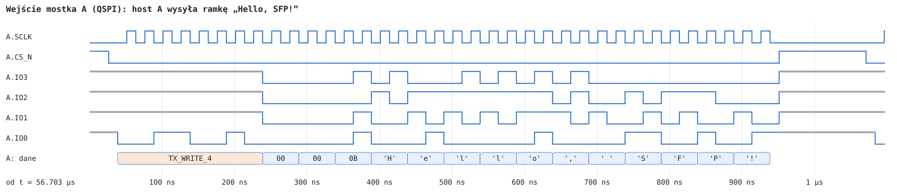
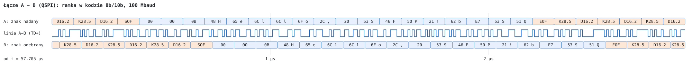
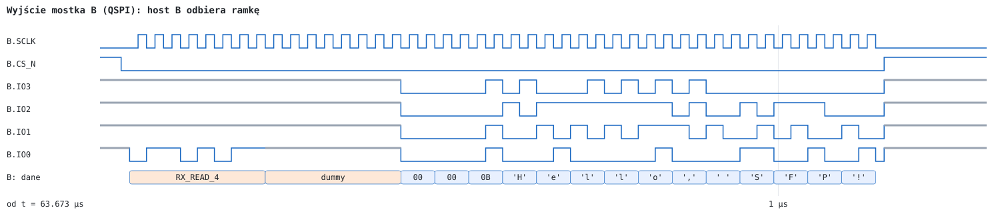

# QSPI ↔ QSPI

Test: `tb_e2e_qspi` (wspólny model `vhdl/sim/tb/e2e_bench.vhd`, `LINES` = 4) · wynik: **PASS (17 checks)**

Oba mostki w trybie xSPI (`MODE_SEL` = 1), SCLK 40 MHz, format 1-0-4: instrukcja na IO0, dane na IO3–IO0 (najpierw starsza tetrada). Host A wysyła dwie ramki komendą `TX_WRITE_4`, host B odbiera je komendą `RX_READ_4` (8 cykli dummy). Pozostałe komendy (`READ_ID`, `READ_STATUS`, `READ_REG`) są zawsze w formacie 1-x-1.

## Przebieg testu

| Krok | Zdarzenie | Czas |
|---|---|---|
| 1 | zwolnienie `HOST_RST_N` obu mostków | 1,00 µs |
| 2 | oba mostki odpowiadają na `READ_ID` (`5B 5F`) — po zablokowaniu PLL (model: 50 µs) i resecie | 53,09 µs |
| 3 | `READ_STATUS` hosta A: `LINK_UP` = 1 | 54,19 µs |
| 4 | host A: `TX_WRITE_4` ramki F1 = `TYPE 0x00`, `LEN 11`, „Hello, SFP!” (14 B) | 56,73 – 57,77 µs |
| 5 | F1 na linii A → B (SOF … EOF, 20 znaków 8b/10b) | od 58,01 µs, 2000 ns |
| 6 | F1 zdekodowana w mostku B (SOF … EOF) | od 58,34 µs |
| 7 | host A: ramka F2 (`LEN 64`, 67 B) | 58,32 – 62,02 µs |
| 8 | host B: `READ_STATUS` (`RX_AVAIL`), `READ_REG` 0x0C (`RX_LEVEL`), `RX_READ_4` | od 63,70 µs |
| 9 | odczyt liczników (`READ_REG`), koniec testu | 83,81 µs |

Opóźnienie F1 od podniesienia CS hosta A (koniec zapisu) do znaku SOF na wejściu kodera mostka A: 230 ns; od SOF nadanego przez A do SOF zdekodowanego w B: 334 ns (serializer, linia 5 ns, deserializer, odzysk danych i wyrównanie symboli). Host B odbiera ramki, gdy odpytanie `READ_STATUS` wykaże `RX_AVAIL` (w teście co ok. 2 µs).

## Sprawdzenia

- obie ramki odebrane przez hosta B w kolejności i bez zmian (`TYPE`, `LEN`, treść);
- `TX_READY` u hosta A przed każdą ramką; `LINK_UP` u obu hostów;
- liczniki: `FRAMES_TX` mostka A = 2, `FRAMES_RX` mostka B = 2, `CODE_ERR` i `CRC_ERR` mostka B = 0.

## Przebiegi

Na rysunkach: linia niebieska — poziom logiczny; gruba szara — linia niesterowana (rezystor podciągający lub stan wysokiej impedancji); pola — bajty, komendy i znaki odczytane przez model testowy (w polach pomarańczowych komendy, faza dummy i znaki sterujące 8b/10b). Czas na osi liczony od początku okna.

### Cały test

Wiersze „transakcje” i „ramki” pokazują odcinki aktywności (transakcje xSPI hosta, ramki na linii); szczegóły na kolejnych rysunkach.

### Wejście mostka A

### Łącze A → B

Górny wiersz: znaki na wejściu kodera 8b/10b mostka A; środkowy: sygnał `SFP_TD+` mostka A (100 Mbaud, bit = 10 ns); dolny: znaki na wyjściu dekodera mostka B, przesunięte o opóźnienie toru. Ramka: `SOF` (K27.7), `TYPE`, `LEN_H`, `LEN_L`, treść, CRC-32 (4 B), `EOF` (K29.7); między ramkami pary bezczynności `K28.5 D16.2` (/I/).

### Wyjście mostka B

