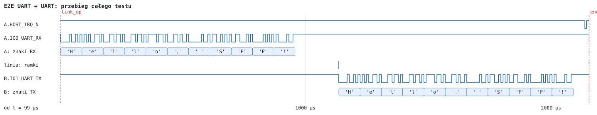
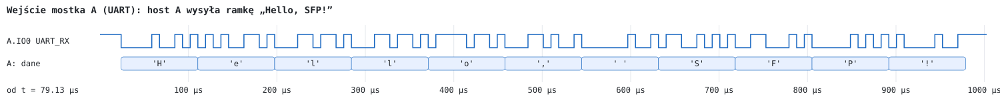
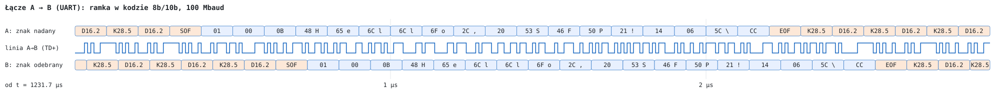
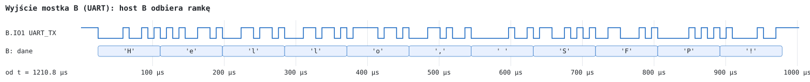

# UART ↔ UART

Test: `tb_e2e_uart` (wspólny model `vhdl/sim/tb/e2e_bench.vhd`, `LINES` = 0) · wynik: **PASS (7 checks)**

Oba mostki w trybie przezroczystym UART wybranym zworką (`MODE_SEL` = 0), 115 200 8N1 (`UART_DIV` = 434 po resecie), bez RTS/CTS. Urządzenie UART po stronie A nadaje na `UART_RX` mostka A (J3 IO0), urządzenie po stronie B odbiera z `UART_TX` mostka B (J3 IO1). Konfiguracja przez xSPI nie jest używana.

## Przebieg testu

| Krok | Zdarzenie | Czas |
|---|---|---|
| 1 | zwolnienie `HOST_RST_N` obu mostków | 1,00 µs |
| 2 | `HOST_IRQ_N` mostka A = 1 (łącze UP; w trybie UART pin sygnalizuje stan łącza) | ≤ 101,00 µs |
| 3 | „Hello, SFP!” (11 B) na `UART_RX` mostka A | 103,00 – 1057,80 µs |
| 4 | ramka `TYPE 0x01` (strumień UART) na linii A → B | od 1232,01 µs, 2000 ns |
| 5 | bajty na `UART_TX` mostka B | 1234,67 – 2189,58 µs |
| 6 | `HOST_RST_N` mostka B = 0: łącze utracone, `HOST_IRQ_N` mostka A = 0; po zwolnieniu łącze wraca, `HOST_IRQ_N` = 1 | 2235,24 – 2253,76 µs |

Ramka jest wysyłana po przerwie na linii RX dłuższej niż 2 czasy znaku (20 bitów, 173,6 µs) od bitu stopu ostatniego bajtu ([ADR 0006](../adr/0006-tryb-uart-przezroczysty.md)); stąd odstęp 174,21 µs między końcem ostatniego bajtu na wejściu A a ramką na linii. Mostek B zaczyna nadawać pierwszy bajt 2,33 µs po SOF zdekodowanym w B, po odebraniu całej ramki (FIFO RX przekazuje tylko ramki zatwierdzone po sprawdzeniu CRC).

## Sprawdzenia

- 11 bajtów na `UART_TX` mostka B, w kolejności, równe bajtom na `UART_RX` mostka A, bez błędów ramki UART;
- `HOST_IRQ_N` = stan łącza: 1 po zestawieniu łącza, 0 po utracie łącza (reset mostka B), 1 po jego powrocie.

## Przebiegi

Na rysunkach: linia niebieska — poziom logiczny; gruba szara — linia niesterowana (rezystor podciągający lub stan wysokiej impedancji); pola — bajty, komendy i znaki odczytane przez model testowy (w polach pomarańczowych komendy, faza dummy i znaki sterujące 8b/10b). Czas na osi liczony od początku okna.

### Cały test

Wiersz „ramki” pokazuje ramkę na linii (ok. 1,5 µs — w tej skali wąska kreska). Na końcu widać spadek `HOST_IRQ_N` mostka A po resecie mostka B.

### Wejście mostka A

### Łącze A → B

Górny wiersz: znaki na wejściu kodera 8b/10b mostka A; środkowy: sygnał `SFP_TD+` mostka A (100 Mbaud, bit = 10 ns); dolny: znaki na wyjściu dekodera mostka B, przesunięte o opóźnienie toru. Ramka: `SOF` (K27.7), `TYPE`, `LEN_H`, `LEN_L`, treść, CRC-32 (4 B), `EOF` (K29.7); między ramkami pary bezczynności `K28.5 D16.2` (/I/).

### Wyjście mostka B

