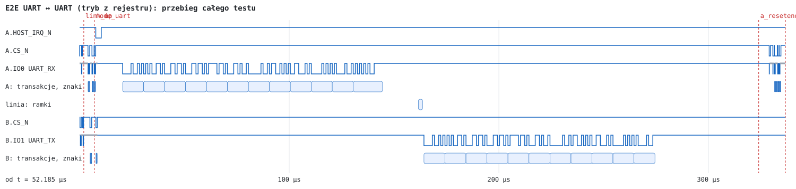
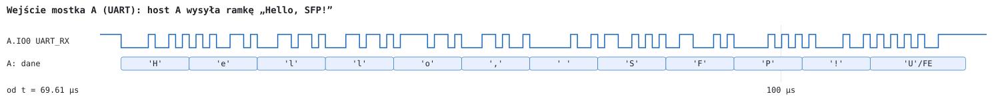
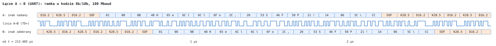
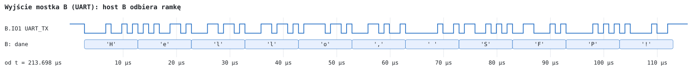
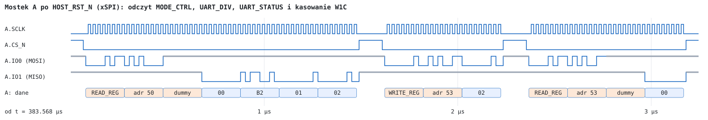

# UART ↔ UART, tryb wybrany rejestrem

Test: `tb_e2e_uart_reg` (wspólny model `vhdl/sim/tb/e2e_bench.vhd`, `LINES` = 9) · wynik: **PASS (15 checks)**

Oba mostki startują w trybie xSPI (`MODE_SEL` = 1). Hosty ustawiają `UART_DIV` = 50 (1 Mbit/s) i przełączają mostki w tryb UART zapisem `MODE_CTRL.UART_MODE` = 1. Urządzenie UART po stronie A nadaje „Hello, SFP!” i jeden bajt z błędnym bitem stopu; urządzenie po stronie B odbiera z `UART_TX` mostka B przy 1 Mbit/s. Na koniec host A wraca do trybu xSPI przez `HOST_RST_N` i odczytuje `UART_STATUS`.

## Przebieg testu

| Krok | Zdarzenie | Czas |
|---|---|---|
| 1 | zwolnienie `HOST_RST_N` obu mostków | 1,00 µs |
| 2 | oba mostki odpowiadają na `READ_ID`; `READ_STATUS` hosta A: `LINK_UP` = 1 | 54,19 µs |
| 3 | hosty A i B: `WRITE_REG` 0x51 = `32 00` (`UART_DIV` = 50), host A: `READ_REG` 0x51 | do 59,22 µs |
| 4 | hosty A i B: `WRITE_REG` 0x50 = `01` — reset mostka, tryb UART z zachowanym `UART_DIV` | od 59,22 µs |
| 5 | `HOST_IRQ_N` mostków A i B = 1 (łącze UP w trybie UART) | ≤ 70,71 µs |
| 6 | „Hello, SFP!” (11 B, 1 Mbit/s) na `UART_RX` mostka A | 72,71 – 182,71 µs |
| 7 | bajt 0x55 z bitem stopu = 0 — błąd ramki, bajt odrzucony, `UART_STATUS.FRAME_ERR` = 1 | 182,71 – 196,71 µs |
| 8 | ramka `TYPE 0x01` (strumień UART) na linii A → B | od 213,78 µs, 2000 ns |
| 9 | bajty na `UART_TX` mostka B | 216,45 – 326,64 µs |
| 10 | `HOST_RST_N` mostka A = 0 przez 5 µs: powrót do trybu xSPI | 376,14 µs |
| 11 | host A: `READ_ID`, `READ_REG` 0x50 (4 B): `MODE_CTRL` = 0, `UART_DIV` = 434, `UART_STATUS` = 0x02; `WRITE_REG` 0x53 = `02` (W1C), `READ_REG` 0x53 = 0 | 381,14 – 388,87 µs |

Przy 1 Mbit/s przerwa kończąca pakiet (20 czasów bitu) trwa 20 µs; odstęp między końcem ostatniego poprawnego bajtu na wejściu A a ramką na linii wynosi 31,07 µs — obejmuje bajt z błędem ramki, który przerwy nie kończy. Mostek B zaczyna nadawać pierwszy bajt 2,33 µs po SOF zdekodowanym w B.

## Sprawdzenia

- `UART_DIV` = 50 odczytany przed przełączeniem trybu; łącze zestawione w trybie UART po resecie wywołanym zapisem `MODE_CTRL` (`HOST_IRQ_N` = 1 u obu mostków);
- 11 bajtów na `UART_TX` mostka B przy 1 Mbit/s, w kolejności, równe bajtom na `UART_RX` mostka A, bez błędów ramki (bajt z błędnym bitem stopu nie jest przesyłany) — prędkość ustawiona rejestrem obowiązuje w trybie UART;
- po `HOST_RST_N`: mostek A odpowiada na `READ_ID` (tryb xSPI), `MODE_CTRL` = 0, `UART_DIV` = 434;
- `UART_STATUS` mostka A = 0x02 (`FRAME_ERR`) po `HOST_RST_N` — rejestr przetrwał reset; po zapisie W1C = 0x00.

## Przebiegi

Na rysunkach: linia niebieska — poziom logiczny; gruba szara — linia niesterowana (rezystor podciągający lub stan wysokiej impedancji); pola — bajty, komendy i znaki odczytane przez model testowy (w polach pomarańczowych komendy, faza dummy i znaki sterujące 8b/10b; bajt z błędem ramki oznaczony „/FE”). Czas na osi liczony od początku okna.

### Cały test

Znaczniki: `mode_uart` — zapis `MODE_CTRL`, `a_reset` — `HOST_RST_N` mostka A. Krótkie odcinki w wierszach „transakcje, znaki” przed `mode_uart` i po `a_reset` to transakcje xSPI; między nimi — znaki UART.

### Wejście mostka A

### Łącze A → B

Górny wiersz: znaki na wejściu kodera 8b/10b mostka A; środkowy: sygnał `SFP_TD+` mostka A (100 Mbaud, bit = 10 ns); dolny: znaki na wyjściu dekodera mostka B.

### Wyjście mostka B

### Odczyt `UART_STATUS` po powrocie do trybu xSPI

`READ_REG` 0x50 z 4 bajtami danych: `MODE_CTRL`, `UART_DIV` (młodszy, starszy bajt), `UART_STATUS`; następnie `WRITE_REG` 0x53 = 0x02 (W1C) i ponowny odczyt 0x53.
